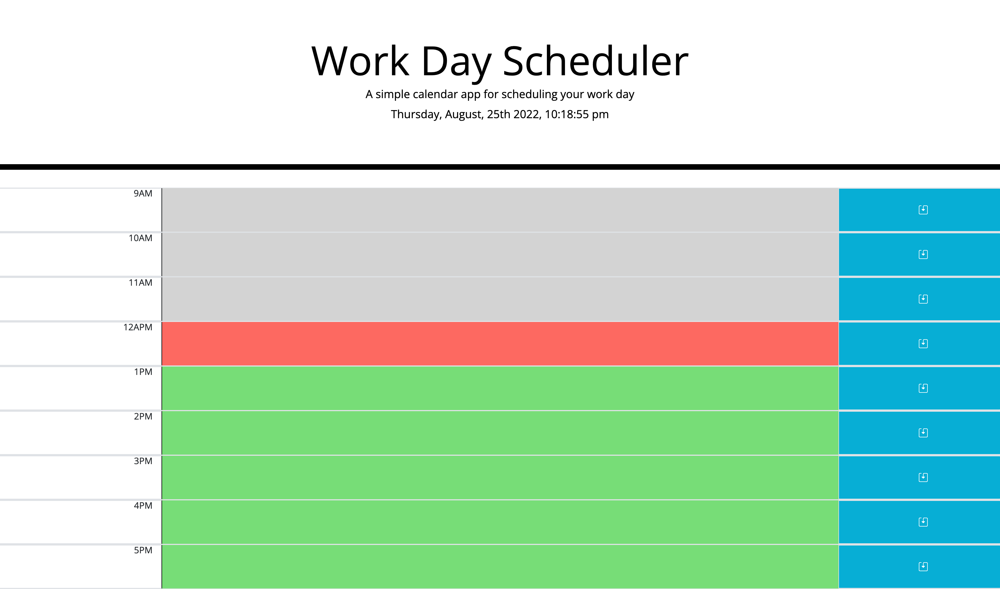
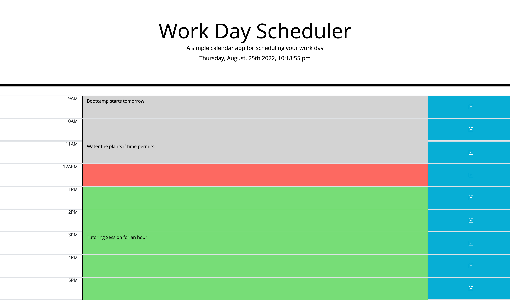

# workday-scheduler
A simple calendar app for scheduling user work day

## Table of Conetents
1. Descriptions 
2. Visuals 
3. Website

## Descriptions
In this modern days when we depend majority of our times on devices (phones, tablets, etc)Being able to do things through our devices is a must. This simple calendar app is using popular library and framework which is Bootstrap and jQuery. It allows the developer to be more proficient and help speed up the work process. This easy to use app features useful functions that enhances user experience. The caleandar displays different colors according to the hours of the day. If it has passed the current hour the input aread will display in gray color. The current time indicates by red color and green for the hours ahead. Users have the ability to save their notes in the app with ease. The current time helps user to stay on track with their tasks. 

## Visuals

```pip
Work Day Scheduler. Displays color-coded input area according to the current time.
```


```pip
User will be able type in their notes and save them in the app.
```


## Website
[Work Day Scheduler App](https://sasimapatterson.github.io/workday-scheduler/)